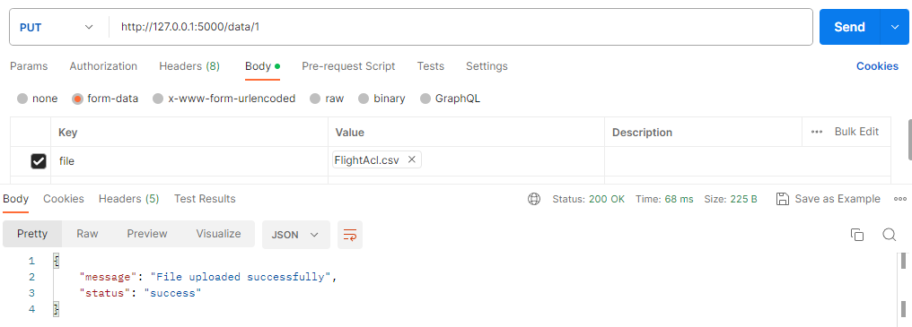
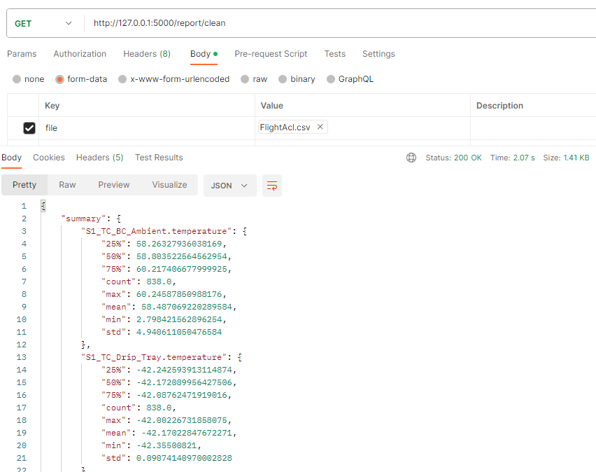
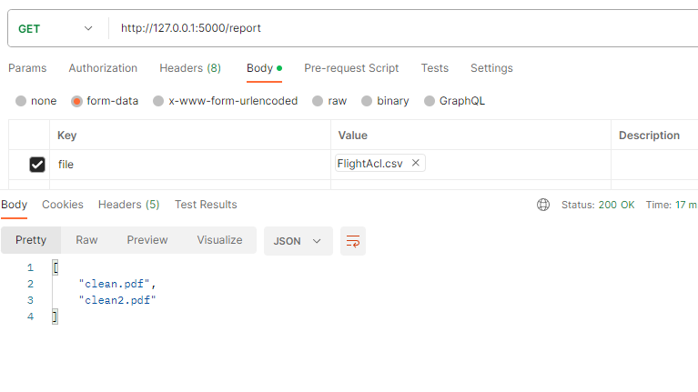

# Operational Data Software Engineer Technical Evaluation 🚀✨

- [About](#about)
- [Getting Started](#getting_started)
- [Usage](#usage)

## Getting Started <a name = "getting_started"></a>

These instructions will get you a copy of the project up and running on your local machine for development and testing purposes. 

### Installation (using Anaconda)

1. Create an Anconda Environment: Open Anaconda Navigator or cmd prompt, run the following command:
```
conda create --name rocket python=3.8
```

2. Activate the Environment
```
conda activate rocket 
```

3. Navigate to the project directory

4. Install the dependencies
```
conda install flask=2.3.2 matplotlib=3.5.1 pandas=1.4.3
```

5. Run the project

## Usage via Postman <a name = "usage"></a>

- For uploading the CSV file, I used Postman to interact with my APIs. Download Postman, create a new collection, run my local script, and then make a PUT request to the `/data/<flight_id>` endpoint with the CSV file attached in the request body. The query should return as below.



- You'll need to run `PUT /data/{flight-id}`, then either `GET /report/{flight-id}` or `GET /report` in that order. 

- Once you run the PUT request, a CSV file is generated in local folder `staticFiles`.

- Once you run `GET /report/{flight-id}`, a pdf report is generated in the folder `reports`, as well as summary stats belonging to that metric.



- Lastly, `GET /report` simply returns a JSON object of report names



## Usage via Command Line

PUT /data/{flight-id}: Uploads CSV file to folder `staticFiles`
```
curl -X PUT -F "file=@FlightAcl.csv" http://localhost:5000/data/1234
```

GET /report/{flight-id}: Generates report to `staticFiles/reports`
```
curl http://localhost:5000/report/1234
```

GET /report: Returns array of all report names
```
curl http://localhost:5000/report
```


## Testing

- The test script is available at `test_main.py`

## Thought Process & Considerations 

### Cleaning
- My initial thoughts for imputing was that I would impute missing values by the column means, but once I found that the proportion of missing values was quite low (5.5% of data), I assumed that removing rows where NaN values exist wouldn't make such a significant impact on the analysis of the temperatures.
- From the visualisations, I assume that removing rows where NaN values exist, only exacerbate the rate of change difference calculation, and as a result it may pick up on multiple cases when temp > 5 degrees celsius. This was an issue I would need to explore further.
- If I had longer time, I would perhaps explore the relationship between the missing data and the data itself and from that it could help better inform my decision making and approach to imputing. I definitely considered many other approaches such as mean and hotdeck imputation, but settled on the most simple approach given the small amount of missing values.

### Rate of Change calculation
- The rate of change calculation could be prone and may not hold up well when subjected to noisy data. A simple difference may not handle noisy data well, so perhaps a more sophisiticated / complex method needs to be explored, given more time.

### Possible Considerations for Future
- I would need to explore more advanced techniques for imputing as I believe it has impacted my current analysis
- Potentially develop a web interface that users could upload data to, request reports and visualise the results interactively could be a nice addition
- Revise the API design, it's quite simple and easy to use, and also limited in features.
- Refining testing, no testing on edge cases have been done as of yet, so is required for later on robustness.


